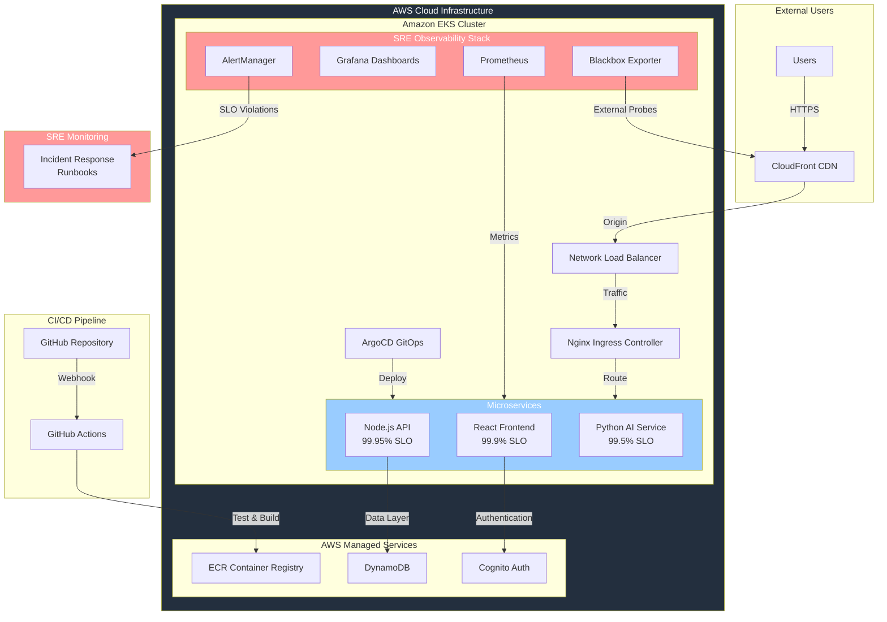

# Todo Table - SRE Portfolio Project

**[日本語版はこちら / Japanese version here](./README_JP.md)**

A Kubernetes-based todo application demonstrating Site Reliability Engineering practices including the Four Golden Signals, SLO-based alerting, and incident response automation on AWS EKS.

## Architecture 🏗️

## Microservice Architecture 🏗️
- **Frontend Service:** React application with nginx, served via CloudFront CDN
- **Backend API:** Node.js/Express service handling business logic and database operations
- **AI Service:** Python FastAPI service for natural language processing with independent scaling
- **Service Communication:** RESTful APIs with proper error handling and circuit breaker patterns
- **Independent Deployment:** Each service can be deployed, scaled, and monitored independently

## 🛠️ Technical Stack

- **Infrastructure**: Amazon EKS, Terraform, ArgoCD
- **Monitoring**: Prometheus, Grafana, AlertManager
- **Applications**: React frontend, Node.js API, Python AI service
- **Data**: DynamoDB, AWS Cognito authentication
- **CI/CD**: GitHub Actions, container registry

## 🎯 SRE Implementation

- **Four Golden Signals**: Latency, traffic, errors, and saturation monitoring
- **SLO-based Alerting**: Error budget burn rate detection with multi-window alerting
- **Incident Response**: Runbooks for common failure scenarios
- **Observability**: Prometheus, Grafana, and AlertManager stack
- **Error Budget Tracking**: SLO-based alerting with burn rate calculation
- **Infrastructure as Code**: Terraform and GitOps with ArgoCD

## 🎯 SLO Targets

| Service | Availability SLO | Latency SLO |
|---------|-----------------|-------------|
| Backend API | 99.95% | <200ms p95 |
| AI Service | 99.5% | <2s p95 |
| Frontend | 99.9% | <2s load time |

## 🌐 Live Demo

- **Application**: [https://todo-app.natsuki-cloud.dev](https://todo-app.natsuki-cloud.dev)

*Monitoring dashboards and infrastructure tools are available for demonstration during interviews.*

## 📚 Documentation

- **[SLI/SLO Definitions](./infra/k8s/app-base/sre-slis-slos.yaml)**: Service level objectives
- **[Alert Rules](./infra/k8s/app-base/sre-alert-rules.yaml)**: Prometheus alerting rules
- **[Incident Runbooks](./infra/k8s/app-base/sre-runbooks.yaml)**: Troubleshooting procedures