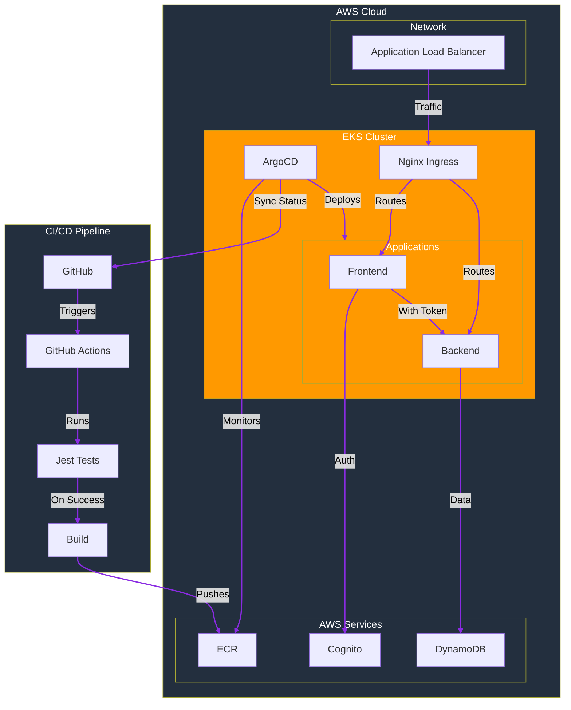

# Todo Table - Cloud-Native DevOps Showcase 🚀

A production-grade application demonstrating modern cloud-native architecture and DevOps practices. Built with Kubernetes-native principles and deployed on AWS EKS, showcasing expertise in container orchestration, infrastructure automation, and GitOps workflows.

## Architecture 🏗️

## Cloud-Native & DevOps Highlights 🎯
- **Kubernetes Architecture:** EKS cluster with multi-AZ deployment and auto-scaling capabilities, supporting high availability through:
  - Multi-AZ node distribution
  - Auto-scaling node groups (0-10 nodes)
  - Rolling updates with controlled disruption
  - AWS-managed highly available control plane
- **Infrastructure as Code:** Terraform implementation with separate components for:
  - EKS cluster with managed node groups
  - VPC networking with private/public subnets
  - IAM roles and policies for service accounts
  - Add-ons: ExternalDNS, Cert-Manager, Sealed Secrets
  - Monitoring stack with Prometheus Operator
  - GitOps setup with ArgoCD
- **GitOps Workflow:** ArgoCD implementation for declarative deployments with automated sync
- **CI/CD Pipeline:** GitHub Actions-based pipeline for automated testing and deployment
- **Testing Implementation:** Comprehensive test suite with:
  - Jest + React Testing Library for frontend
  - Component and integration tests
  - Automated test execution in CI/CD
  - Mock implementations for auth and API
  - Date validation and utility testing
- **Observability:** Prometheus and Grafana integration for monitoring and alerting
- **Security:** IAM roles for service accounts, Sealed Secrets for secret management

## Technical Stack 🛠️
- **Container Orchestration:** Kubernetes (EKS), Helm
- **Infrastructure:** Terraform, AWS (EKS, DynamoDB, Cognito)
- **CI/CD:** GitHub Actions, ArgoCD
- **Testing:** Jest, React Testing Library
- **Monitoring:** Prometheus, Grafana
- **Security:** AWS IAM, Sealed Secrets
- **Application:** React, Node.js, Express, DynamoDB

## DevOps Practices Demonstrated 📈
- Infrastructure as Code (Terraform)
- GitOps (ArgoCD)
- Containerization and Kubernetes
- Automated CI/CD pipelines
- Comprehensive testing strategy
- Infrastructure monitoring
- Security best practices
- Multi-environment management

## Live Demo 🌐
[https://todo-app.natsuki-cloud.dev](https://todo-app.natsuki-cloud.dev)

## Source Code 🔍
[GitHub Repository](https://github.com/tsuki-yo/todo-table)

