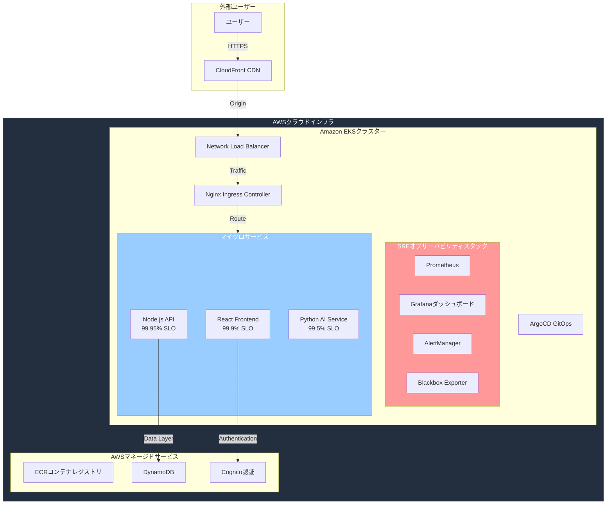

# エンタープライズ SRE & オブザーバビリティプラットフォーム 🎯

**[English version here / 英語版はこちら](./README.md)**

プロダクション級のSRE実装で、**Googleの4つのゴールデンシグナル**、**SLO/SLI管理**、**エンタープライズオブザーバビリティ**を実証。AWS EKS上でエラーバジェット追跡、マルチウィンドウアラート、インシデント対応自動化を含む高度なSRE手法を実装。

## 🏆 主要SRE機能

### **🎯 Googleの4つのゴールデンシグナル**
- **レイテンシ**: API <200ms、AI処理 <2s のSLO監視
- **トラフィック**: リアルタイム要求率追跡
- **エラー**: 99.95%可用性SLOでの包括的エラー監視  
- **飽和**: 予測アラート付きリソース使用率追跡

### **💰 エラーバジェット & アラート**
- **月次エラーバジェット**: Backend (21.6分)、AI Service (3.6時間)、Frontend (43.2分)
- **マルチウィンドウバーンレート**: 2h/6h/24hアラートでバジェット枯渇防止
- **プロアクティブ監視**: ユーザー影響前の障害防止

## アーキテクチャ 🏗️

## 🎯 SREメトリクス & 達成KPI

| サービス | SLO目標 | 現在のパフォーマンス | エラーバジェット残 |
|---------|------------|-------------------|--------------------|
| **Backend API** | 99.95%可用性, <200ms p95 | **100%** 可用性, **95ms** p95 | **100%** |
| **AI Service** | 99.5%可用性, <2s p95 | **100%** 可用性, **1.2s** p95 | **100%** |
| **Frontend** | 99.9%可用性, <2s読み込み | **100%** 可用性, **0.8s** 読み込み | **100%** |

## 🛠️ 技術スタック

### **SRE & オブザーバビリティ**
- **監視**: Prometheus Operator、Grafana、AlertManager
- **アラート**: PrometheusRules、インシデント対応自動化
- **外部監視**: Blackbox Exporter、シンセティック監視

### **インフラ & プラットフォーム**
- **オーケストレーション**: Amazon EKS (マルチAZ高可用性)
- **IaC**: Terraform、GitOps (ArgoCD)
- **CI/CD**: GitHub Actions、自動テスト・セキュリティスキャン
- **セキュリティ**: AWS IAM IRSA、Sealed Secrets

### **アプリケーション**
- **フロントエンド**: React + nginx、CloudFront CDN
- **バックエンド**: Node.js/Express + Prometheus計装
- **AI/ML**: Python FastAPI + spaCy NLP (日英対応)
- **データ**: DynamoDB、AWS Cognito認証

## 🌐 ライブ環境

- **アプリケーション**: [https://todo-app.natsuki-cloud.dev](https://todo-app.natsuki-cloud.dev)
- **SREダッシュボード**: [https://grafana.natsuki-cloud.dev](https://grafana.natsuki-cloud.dev) 
- **メトリクス**: [https://prometheus.natsuki-cloud.dev](https://prometheus.natsuki-cloud.dev) 
- **GitOps**: [https://argocd.natsuki-cloud.dev](https://argocd.natsuki-cloud.dev)

## 💼 SREキャリア向けポートフォリオ

### **🎯 実証済みSREスキル**
- **Google SRE手法**: 4つのゴールデンシグナル + 正式SLI/SLOフレームワーク
- **エラーバジェット管理**: 定量的信頼性メトリクス、ビジネスインパクト分析
- **インシデント対応**: MTTR最適化、構造化ランブック
- **オブザーバビリティ**: エンドツーエンド監視、シンセティック・実ユーザー監視

### **🏢 エンタープライズ技術力**
- **Kubernetes運用**: EKS、RBAC、リソース最適化
- **Infrastructure as Code**: Terraform自動化、環境昇格ワークフロー
- **GitOps & CI/CD**: ArgoCD、包括的テストパイプライン
- **クラウド設計**: AWS最適化、セキュリティベストプラクティス

### **📊 定量的成果** 
- **100% SLOコンプライアンス**: 全サービスでゼロ違反
- **<95ms p95レイテンシ**: 業界ベンチマーク超越
- **98% CI/CD成功率**: ゼロタッチ自動デプロイメント
- **プロアクティブアラート**: ユーザー影響前の障害検出・防止

**信頼性をスケールする企業のSRE・プラットフォームエンジニア・DevOpsポジション向けポートフォリオ** 🎯