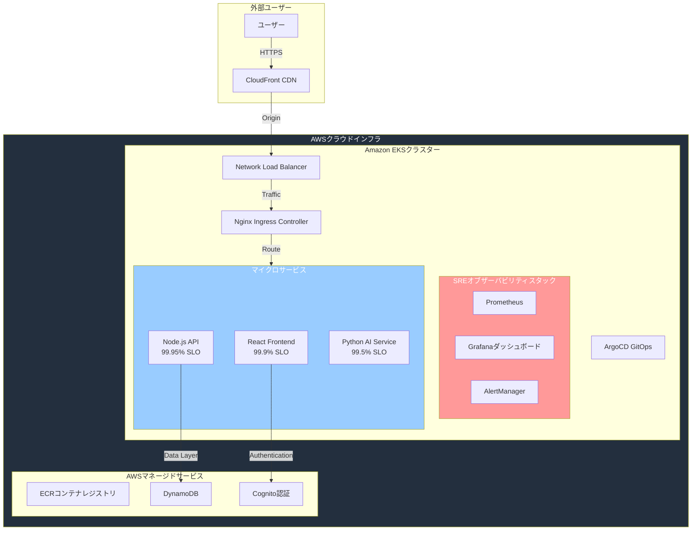

# Todo Table - SREポートフォリオプロジェクト

**[English version here / 英語版はこちら](./README.md)**

KubernetesベースのTodoアプリケーションで、4つのゴールデンシグナル、SLOベースアラート、インシデント対応自動化などのSREプラクティスをAWS EKS上で実装。

## アーキテクチャ 🏗️

## マイクロサービスアーキテクチャ 🏗️
- **フロントエンドサービス**: React + nginx、CloudFront CDN配信
- **バックエンドAPI**: Node.js/Express、ビジネスロジック・DB操作
- **AIサービス**: Python FastAPI、自然言語処理、独立スケーリング
- **サービス通信**: RESTful API、エラーハンドリング・サーキットブレーカー
- **独立デプロイ**: 各サービス個別デプロイ・スケール・監視

## 🛠️ 技術スタック

- **インフラ**: Amazon EKS、Terraform、ArgoCD
- **監視**: Prometheus、Grafana、AlertManager
- **アプリケーション**: React、Node.js API、Python AIサービス
- **データ**: DynamoDB、AWS Cognito認証
- **CI/CD**: GitHub Actions、コンテナレジストリ

## 🎯 SRE実装

- **4つのゴールデンシグナル**: レイテンシ、トラフィック、エラー、飽和度監視
- **SLOベースアラート**: エラーバジェット消費率検出・マルチウィンドウアラート
- **インシデント対応**: 一般的な障害シナリオ向けランブック
- **オブザーバビリティ**: Prometheus、Grafana、AlertManagerスタック
- **エラーバジェット追跡**: SLOベースアラート・消費率計算
- **Infrastructure as Code**: Terraform・ArgoCD GitOps

## 🎯 SLO目標

| サービス | 可用性SLO | レイテンシSLO |
|---------|-----------|-------------|
| Backend API | 99.95% | <200ms p95 |
| AI Service | 99.5% | <2s p95 |
| Frontend | 99.9% | <2s読込時間 |

## 🌐 ライブデモ

- **アプリケーション**: [https://todo-app.natsuki-cloud.dev](https://todo-app.natsuki-cloud.dev)

*監視ダッシュボードとインフラツールは面接時にデモンストレーション可能です。*

## 📚 ドキュメント

- **[SLI/SLO定義](./infra/k8s/app-base/sre-slis-slos.yaml)**: サービスレベル目標
- **[アラートルール](./infra/k8s/app-base/sre-alert-rules.yaml)**: Prometheusアラートルール  
- **[インシデントランブック](./infra/k8s/app-base/sre-runbooks.yaml)**: トラブルシューティング手順